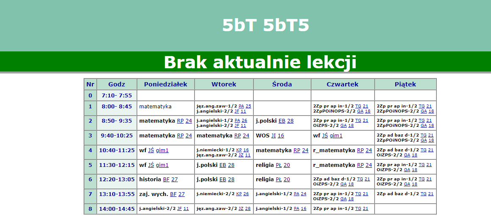

## Działanie
Zmienia kolor komórki w tabeli/paragrafu oraz oblicza czas do końca przerwy/leckji.

## Ustawienia(obiekt settings)
Tam możesz zmienić kolor

## Ważne
- kod umieścić w folderze scripts w pliku powrot.js (najlepsza opcja)
- godziny na planie leckji muszą być dokładne, czyli nie mogą być (7:00- 7:00)

## Screenshots
